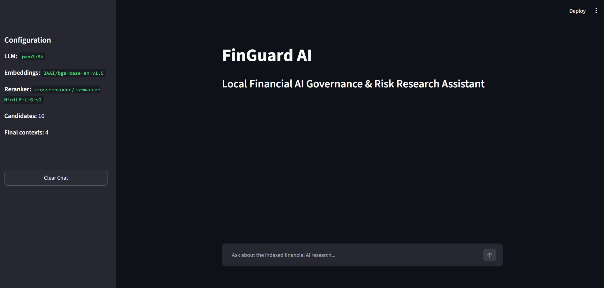
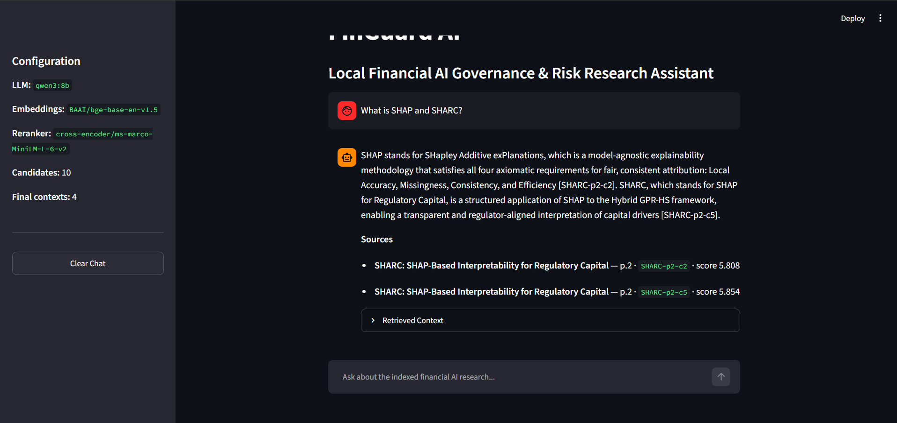
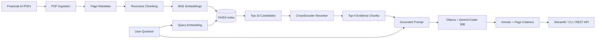
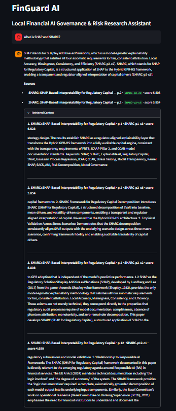
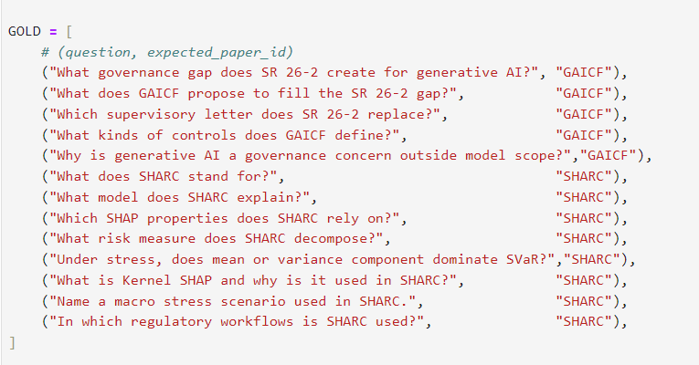
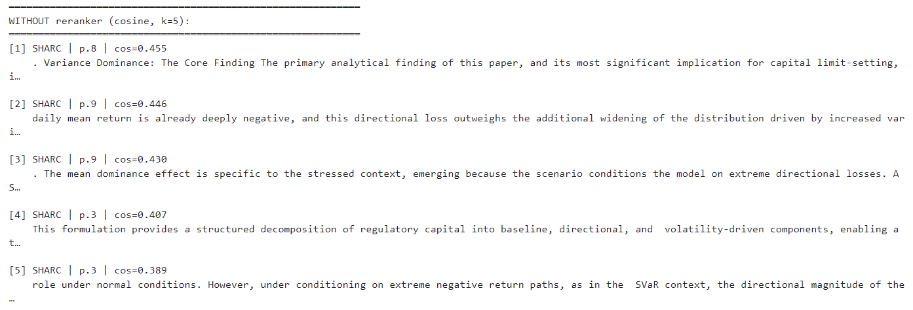
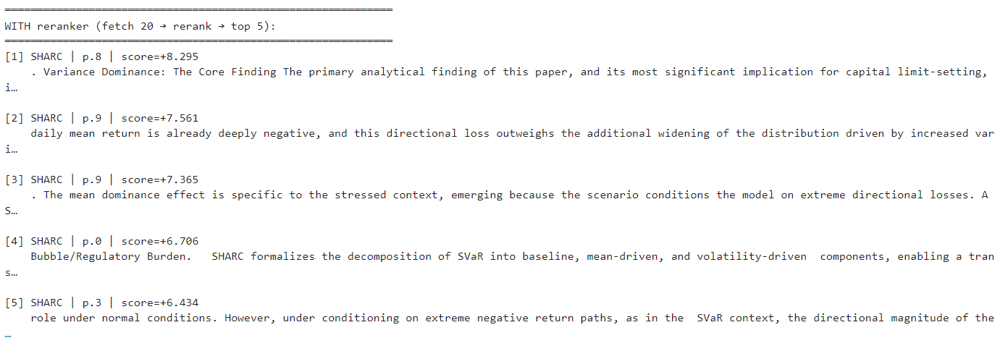

<div align="center">

# 🛡️ FinGuard AI

### Local Retrieval-Augmented Generation for Financial AI Governance and Explainable Risk Models

[](https://github.com/SiddharthMuneshwar26/FinGuard_RAG/actions/workflows/ci.yml)
[](https://www.python.org/)
[](https://www.python.org/)
[](https://fastapi.tiangolo.com/)
[](Dockerfile)
[](https://streamlit.io/)
[](https://ollama.com/)
[](https://ollama.com/library/qwen3-coder)
[](https://huggingface.co/BAAI/bge-base-en-v1.5)
[](https://github.com/facebookresearch/faiss)
[](LICENSE)

**FinGuard AI** is an end-to-end, locally hosted RAG assistant that retrieves, reranks and explains research on financial AI governance, model-risk management, regulatory capital and explainable machine learning.

It combines dense retrieval, CrossEncoder reranking, grounded prompting, local LLM generation and page-level citations in a Streamlit interface and a FastAPI REST service.

[Features](#-key-features) •
[Architecture](#-system-architecture) •
[Installation](#-installation-and-setup) •
[Usage](#-usage) •
[REST API](#-rest-api) •
[Docker](#-docker) •
[Testing](#-testing-and-ci) •
[Evaluation](#-retrieval-evaluation)

</div>

---

## 📌 Overview

Financial institutions increasingly use machine learning and generative AI in high-stakes workflows. These systems must be accurate, explainable, auditable and governed with appropriate controls.

FinGuard AI provides a focused research assistant over two complementary financial-AI papers:

1. **SHARC: SHAP-Based Interpretability in Machine Learning Risk Models for Regulatory Capital under ICAAP and CCAR**
2. **Governing Generative AI Across Financial Institutions: An SR 26-2-Compatible Framework for Generative AI Risk Control**

The assistant answers questions using retrieved evidence from the indexed documents rather than relying only on the language model's internal knowledge.

<p align="center">
  
</p>

<p align="center">
  <em>FinGuard AI's local Streamlit interface and model configuration panel.</em>
</p>

### Example questions

```text
What is SHAP and SHARC?

Why is interpretability important for regulatory capital models?

What risks arise when banks deploy generative AI?

What controls should financial institutions apply to generative AI systems?
 
```
### Example grounded response

<p align="center">
  
</p>

<p align="center">
  <em>A grounded response generated from retrieved SHARC evidence with page and chunk citations.</em>
</p>

---

## ✨ Key Features

- **Fully local generation** with Ollama and Qwen3-Coder 30B (configurable through `OLLAMA_MODEL`)
- **Dense semantic retrieval** using BAAI BGE embeddings
- **FAISS vector search** over document chunks
- **CrossEncoder reranking** to improve result ordering
- **Top-10 retrieval → top-4 final context** pipeline
- **Grounded prompting** that restricts answers to retrieved evidence
- **Page-level citations** with document title, page and stable chunk ID
- **Retrieved-context inspection** for transparency and debugging
- **Streamlit chat interface** with chat history and clear-chat controls
- **CLI interface** for fast backend testing
- **FastAPI REST service** with `GET /health` and `POST /query`, returning citations, evidence chunks and per-stage latency
- **Retrieval-only mode** (`generate=false`) that returns reranked evidence without calling an LLM
- **Containerised build** with a CPU-only Docker image that bundles the embedding model, the reranker and the FAISS index
- **Automated API tests** with pytest
- **GitHub Actions CI** that runs the tests and builds the Docker image on every push and pull request to `main`
- **Metadata-aware ingestion** with titles, filenames, page numbers and document IDs
- **Retrieval evaluation** using Hit@k and Mean Reciprocal Rank on a curated gold set
- **Local-first design** with no mandatory paid LLM API

---

## 🧠 System Architecture


```mermaid
flowchart LR
    A[Financial-AI PDFs] --> B[PDF Ingestion]
    B --> C[Page Metadata]
    C --> D[Recursive Chunking]
    D --> E[BGE Embeddings]
    E --> F[(FAISS Index)]

    Q[User Question] --> G[Query Embedding]
    G --> F
    F --> H[Top-10 Candidates]
    H --> I[CrossEncoder Reranker]
    I --> J[Top-4 Evidence Chunks]
    J --> K[Grounded Prompt]
    Q --> K
    K --> L[Ollama + Qwen3-Coder 30B]
    L --> M[Answer + Page Citations]
    M --> N[Streamlit / CLI / REST API]
```

### Query-time flow

```text
Question
   ↓
BAAI/bge-base-en-v1.5 query embedding
   ↓
FAISS dense retrieval — top 10
   ↓
cross-encoder/ms-marco-MiniLM-L-6-v2 reranking
   ↓
Best 4 evidence chunks
   ↓
Grounded prompt
   ↓
Ollama running Qwen3-Coder 30B (skipped when generate=false)
   ↓
Answer with document and page citations
```

---

## 🛠️ Technology Stack

| Layer | Tool / Model | Purpose |
|---|---|---|
| Language | Python | Core application and pipeline |
| Experimentation | Jupyter Notebook | Chunking, retrieval and evaluation experiments |
| Document parsing | pypdf | Page-level PDF text extraction |
| Document schema | LangChain Core | Document objects and metadata |
| Text splitting | LangChain Text Splitters | Recursive chunking |
| Embeddings | `BAAI/bge-base-en-v1.5` | Dense semantic representations |
| Embedding integration | LangChain Hugging Face | Connects BGE embeddings to the pipeline |
| Vector database | FAISS CPU | Local similarity search and persistence |
| Reranker | `cross-encoder/ms-marco-MiniLM-L-6-v2` | Query-passage relevance scoring |
| Reranker library | Sentence Transformers | CrossEncoder inference |
| Local model runtime | Ollama | Local LLM serving |
| Generator | `qwen3-coder:30b` | Grounded natural-language answers |
| User interface | Streamlit | Interactive research chat |
| REST API | FastAPI + Uvicorn | HTTP health and query endpoints |
| Containerisation | Docker | Reproducible CPU-only service image |
| Testing | pytest | API tests with a mocked pipeline |
| CI | GitHub Actions | Test run and Docker build on push/PR |
| HTTP health/error handling | Requests | Ollama connection checks |
| Version control | Git and GitHub | Source control and portfolio hosting |

---

## 🔍 Retrieval Design

### 1. Page-level ingestion

Each PDF is loaded page by page. The pipeline preserves metadata including:

```python
{
    "title": "...",
    "filename": "...",
    "document_id": "...",
    "page": 9,
    "chunk_id": "SHARC-p9-c1"
}
```

This metadata supports traceable citations in generated answers.

### Evidence transparency

Users can inspect the exact reranked passages supplied to the LLM, including
the source paper, page number, chunk ID and reranker score.

<p align="center">
  
</p>

### 2. Recursive chunking

The current indexing configuration uses:

```text
Chunk size:    800 characters
Chunk overlap: 150 characters
```

The overlap helps preserve meaning when an explanation crosses a chunk boundary.

### 3. Dense retrieval

Both chunks and user questions are embedded using:

```text
BAAI/bge-base-en-v1.5
```

The vectors are stored in a persistent local FAISS index. With the current two-paper knowledge base and chunking configuration, the pipeline produces **136 document vectors**.

### 4. CrossEncoder reranking

FAISS retrieves the top 10 candidates. A CrossEncoder then jointly scores each question-passage pair:

```text
cross-encoder/ms-marco-MiniLM-L-6-v2
```

Only the top 4 passages are sent to the LLM. This provides broader initial recall while keeping the final context focused.

### 5. Grounded generation

The LLM is instructed to:

- answer only from the retrieved context;
- avoid unsupported claims;
- state when the documents do not contain enough information;
- cite the evidence used;
- distinguish proposals, findings and general practices;
- avoid presenting research explanations as investment advice.

---

## 📁 Project Structure

```text
FinGuard-RAG/
├── .github/
│   └── workflows/
│       └── ci.yml             # GitHub Actions: pytest + Docker image build
├── api/
│   └── main.py                # FastAPI service (/health, /query)
├── app.py                     # Streamlit chat interface
├── assets/                     # README screenshots and evaluation visuals
├── data/                      # Source research papers
├── deploy/
│   ├── DEPLOY.md              # Cloud Run deployment guide (not deployed)
│   ├── deploy.sh              # Manual build, push and deploy script
│   └── teardown.sh            # Manual cleanup script
├── notebooks/                 # Experiments and retrieval evaluation
├── src/
│   ├── __init__.py
│   ├── app.py                 # Alternative Streamlit interface
│   ├── app1.py                # Earlier Streamlit front end
│   ├── chatbot.py             # Backward-compatible answer facade
│   ├── config.py              # Paths, model names, retrieval settings and env vars
│   ├── ingest.py              # PDF extraction and metadata
│   ├── chunking.py            # Recursive splitting and chunk IDs
│   ├── embeddings.py          # BGE embedding configuration
│   ├── vectorstore.py         # FAISS creation, loading and persistence
│   ├── retrieval.py           # Top-k dense retrieval
│   ├── retrieve.py            # Backward-compatible retrieval facade
│   ├── reranker.py            # CrossEncoder reranking
│   ├── prompts.py             # Grounding and citation instructions
│   ├── llm.py                 # Ollama client
│   ├── rag_chain.py           # End-to-end RAG orchestration
│   ├── build_index.py         # Index-building CLI
│   ├── cli.py                 # Terminal question-answering interface
│   └── requirements.txt       # Points to the root requirements.txt
├── tests/
│   └── test_api.py            # pytest API tests with a mocked RAG pipeline
├── vectorstore/               # Prebuilt FAISS index (index.faiss, index.pkl), committed
├── .dockerignore              # Keeps data, notebooks, tests and docs out of the image
├── .gitignore
├── Dockerfile                 # CPU-only API image (Python 3.12)
├── LICENSE
├── NOTES.md                   # Verification log for the API, tests, Docker and CI
├── PROJECT_SUMMARY.md
├── README.md
└── requirements.txt
```

The prebuilt `vectorstore/` index (about 540 KB) is committed so that the Docker image and the API work without rebuilding it, even though `.gitignore` lists the directory. Other generated indexes (`vectorstore_v2/`, `notebooks/vectorstore/`), serialized chunks (`chunks*.pkl`), Python caches and the virtual environment are excluded from Git.

---

## 🚀 Installation and Setup

### Prerequisites

- Windows, Linux or macOS
- Python 3.12 or 3.13: the Docker image and CI use Python 3.12; the original local setup was tested on Python 3.13
- Git
- Ollama (only needed for answer generation; retrieval-only API requests do not use it)
- Enough memory to run Qwen3-Coder 30B locally
- Docker (optional, for the container image)

> The project works with CPU-based FAISS and PyTorch. Ollama can use supported GPU acceleration independently.

### 1. Clone the repository

```powershell
git clone https://github.com/SiddharthMuneshwar26/FinGuard_RAG.git
cd FinGuard_RAG
```

### 2. Create a virtual environment

#### Windows PowerShell

```powershell
python -m venv .venv
```

Packages can be installed directly through the environment interpreter without activating it:

```powershell
.\.venv\Scripts\python.exe -m pip install --upgrade pip
.\.venv\Scripts\python.exe -m pip install -r requirements.txt
```

#### Linux or macOS

```bash
python3 -m venv .venv
source .venv/bin/activate
pip install --upgrade pip
pip install -r requirements.txt
```

### 3. Install and prepare Ollama

Install Ollama from its official website, then pull the local model:

```powershell
ollama pull qwen3-coder:30b
```

Test it:

```powershell
ollama run qwen3-coder:30b
```

Exit the interactive Ollama session with:

```text
/bye
```

Keep the Ollama service running while using FinGuard AI.

To use a different Ollama model or server, set `OLLAMA_MODEL` and `OLLAMA_BASE_URL` (see [Environment variables](#environment-variables)).

### 4. Add the source papers

Place the licensed PDFs inside:

```text
data/
```

The default knowledge base expects the SHARC and financial GenAI-governance papers.

### 5. Build the FAISS index

A prebuilt index is committed in `vectorstore/`, so this step is only needed after changing the documents or chunk settings.

```powershell
.\.venv\Scripts\python.exe -m src.build_index --force
```

This performs:

```text
PDF loading
→ metadata creation
→ recursive chunking
→ BGE embedding generation
→ FAISS index creation
→ local persistence
```

---

## 💬 Usage

### Streamlit interface

```powershell
.\.venv\Scripts\python.exe -m streamlit run app.py
```

Streamlit will display a local URL, normally:

```text
http://localhost:8501
```

The interface includes:

- conversational question answering;
- source citations;
- document page and chunk metadata;
- reranker scores;
- expandable retrieved context;
- model and retrieval configuration;
- chat-history clearing;
- actionable errors for missing indexes, Ollama connectivity and unavailable models.

### Command-line interface

Ask a single question:

```powershell
.\.venv\Scripts\python.exe -m src.cli "What is SHAP?"
```

Additional examples:

```powershell
.\.venv\Scripts\python.exe -m src.cli "Why is model interpretability important under ICAAP?"
```

```powershell
.\.venv\Scripts\python.exe -m src.cli "What controls should banks apply to generative AI?"
```

### Rebuild after changing documents or chunk settings

```powershell
.\.venv\Scripts\python.exe -m src.build_index --force
```

---

## 🔌 REST API

FinGuard also exposes the RAG pipeline as a FastAPI service (`api/main.py`). The FAISS index, embedding model and reranker are loaded once at startup.

### Run locally

```powershell
.\.venv\Scripts\python.exe -m uvicorn api.main:app --host 127.0.0.1 --port 8000
```

Interactive OpenAPI documentation is then available at `http://127.0.0.1:8000/docs`.

### Endpoints

| Method | Path | Description |
|---|---|---|
| `GET` | `/health` | Liveness check, returns `{"status": "ok"}` |
| `POST` | `/query` | Retrieval, reranking and optional grounded generation |

### `POST /query` request body

| Field | Type | Default | Constraints | Description |
|---|---|---|---|---|
| `question` | string | required | 1–1000 characters | Question to answer |
| `top_k` | integer | `4` | 1–10 | Number of reranked chunks to return or use as context |
| `generate` | boolean | `true` | | `false` returns retrieved evidence only, without calling the LLM |

With `generate=false`, `answer` is `null`, `citations` lists every returned chunk and `latency_ms.generation` is `0.0`. With `generate=true`, `citations` contains only the chunks the LLM cited inline. Generation requires a reachable Ollama server.

### Example requests

Health check:

```powershell
curl.exe http://127.0.0.1:8000/health
```

```bash
curl http://127.0.0.1:8000/health
```

Retrieval only (no LLM):

```powershell
$body = '{"question": "What is SHAP?", "top_k": 4, "generate": false}'
$body | curl.exe -s -X POST http://127.0.0.1:8000/query -H "Content-Type: application/json" --data-binary "@-"
```

```bash
curl -s -X POST http://127.0.0.1:8000/query \
  -H "Content-Type: application/json" \
  -d '{"question": "What is SHAP?", "top_k": 4, "generate": false}'
```

Retrieval and generation (requires Ollama):

```powershell
$body = '{"question": "What is SHAP?", "top_k": 4, "generate": true}'
$body | curl.exe -s -X POST http://127.0.0.1:8000/query -H "Content-Type: application/json" --data-binary "@-"
```

```bash
curl -s -X POST http://127.0.0.1:8000/query \
  -H "Content-Type: application/json" \
  -d '{"question": "What is SHAP?", "top_k": 4, "generate": true}'
```

### Example response (`generate=false`, shortened)

Real output from the committed index, trimmed to one citation and one chunk. Latency values vary by machine.

```json
{
  "answer": null,
  "citations": [
    {
      "title": "SHARC: SHAP-Based Interpretability for Regulatory Capital",
      "filename": "SHARC.pdf",
      "file": "SHARC.pdf",
      "page": 3,
      "chunk_id": "SHARC-p3-c4",
      "rerank_score": 6.054914474487305
    }
  ],
  "chunks": [
    {
      "chunk_id": "SHARC-p3-c4",
      "filename": "SHARC.pdf",
      "page": 3,
      "content": "suited for regulatory applications due to its axiomatic grounding. Lundberg and Lee (2017) demonstrated\nthat SHAP is the...",
      "retrieval_distance": 0.858666718006134,
      "rerank_score": 6.054914474487305,
      "rerank_position": 1
    }
  ],
  "latency_ms": {
    "retrieval": 29.91,
    "rerank": 65.24,
    "generation": 0.0,
    "total": 95.15
  }
}
```

With `generate=true`, `answer` contains the grounded answer with inline chunk-ID citations such as `[SHARC-p3-c4]`, and `latency_ms.generation` records the LLM time.

### Error responses

| Status | When |
|---|---|
| `422` | Request validation fails (for example, an empty `question` or `top_k` outside 1–10) |
| `503` | The pipeline raises a runtime error, such as Ollama being unreachable or returning an unexpected response |
| `500` | Any other unexpected error (`{"detail": "Internal server error"}`) |

### Environment variables

These are read by `src/config.py` and apply to the API, the Streamlit app, the CLI and the Docker container.

| Variable | Default | Purpose |
|---|---|---|
| `OLLAMA_BASE_URL` | `http://localhost:11434` | Ollama server used for generation |
| `OLLAMA_MODEL` | `qwen3-coder:30b` | Ollama model name |
| `OLLAMA_TIMEOUT_SECONDS` | `180` | Timeout for each Ollama request |
| `LLM_TEMPERATURE` | `0.2` | Sampling temperature |
| `LLM_MAX_TOKENS` | `512` | Maximum generated tokens |
| `FINGUARD_EMBEDDING_DEVICE` | `cpu` | Device for the BGE embedding model |
| `FINGUARD_RERANKER_DEVICE` | `cpu` | Device for the CrossEncoder reranker |
| `PORT` | `8080` | Listening port inside the Docker container only |

---

## 🐳 Docker

The `Dockerfile` builds a CPU-only image of the REST API.

### What the image contains

- `python:3.12-slim` base image
- CPU-only PyTorch, installed from the PyTorch CPU wheel index so that no CUDA packages are pulled in
- `BAAI/bge-base-en-v1.5` and `cross-encoder/ms-marco-MiniLM-L-6-v2`, downloaded into the image at build time
- The committed FAISS index from `vectorstore/`
- Only `api/` and `src/` application code (`.dockerignore` excludes `data/`, `notebooks/`, `tests/`, `assets/` and the docs)
- A non-root `appuser` (UID 10001)
- Uvicorn listening on `$PORT`, defaulting to `8080`

The image does **not** include Ollama. Retrieval-only requests (`"generate": false`) work without any LLM backend. Generation requests (`"generate": true`) need an Ollama server reachable from the container through `OLLAMA_BASE_URL`. Without one, they return HTTP `503`.

### Build

The same commands work in PowerShell and in Linux/macOS shells.

```bash
docker build -t finguard-rag-api .
```

### Run

```bash
docker run --rm -p 8080:8080 finguard-rag-api
```

With a custom port:

```bash
docker run --rm -e PORT=9000 -p 9000:9000 finguard-rag-api
```

Check the running container:

```powershell
curl.exe http://127.0.0.1:8080/health
```

```bash
curl http://127.0.0.1:8080/health
```

To enable generation against an Ollama server running on the host, pass its address:

```bash
docker run --rm -p 8080:8080 -e OLLAMA_BASE_URL=http://host.docker.internal:11434 finguard-rag-api
```

This was verified with Docker Desktop on Windows. On Linux, `host.docker.internal` usually also requires `--add-host=host.docker.internal:host-gateway` (not tested).

---

## 🧪 Testing and CI

### Run the tests

`pytest` is not listed in `requirements.txt`, so install it first:

```powershell
.\.venv\Scripts\python.exe -m pip install pytest
.\.venv\Scripts\python.exe -m pytest -v
```

### What the tests cover

`tests/test_api.py` replaces the RAG pipeline with a fake, so the tests need neither the models nor Ollama:

| Test | Checks |
|---|---|
| `test_health` | `GET /health` returns `200` and `{"status": "ok"}` |
| `test_query_retrieval_only` | `generate=false` returns `answer: null`, citations, chunks and zero generation latency |
| `test_query_generation` | `generate=true` returns an answer, citations, chunks and generation latency |
| `test_query_rejects_invalid_top_k` | `top_k=0` returns `422` |
| `test_query_rejects_empty_question` | An empty `question` returns `422` |
| `test_query_returns_503_for_runtime_error` | A pipeline `RuntimeError` returns `503` with its message |
| `test_query_returns_500_for_unexpected_error` | Any other exception returns `500` with `Internal server error` |

### GitHub Actions

[`.github/workflows/ci.yml`](.github/workflows/ci.yml) runs on every push and pull request to `main`:

1. **`test` job:** sets up Python 3.12, installs `requirements.txt` and `pytest`, then runs `python -m pytest -v`.
2. **`docker-build` job:** runs after `test` passes and builds the Docker image with Buildx, without pushing it to any registry.

CI does not deploy the service or run Ollama.

---

## ☁️ Deployment

Deployment artifacts are included, but the service is **not currently deployed**.

- [`deploy/DEPLOY.md`](deploy/DEPLOY.md) is the step-by-step guide for a private, scale-to-zero Google Cloud Run service: authentication required, 0–1 instances, concurrency 4, 2 CPU, 4 GiB memory, 300-second timeout, port 8080 and `HF_HUB_OFFLINE=1`. It also covers the spend-cap budget, identity-token tests, cold-start measurement, costs and teardown.
- `deploy/deploy.sh` and `deploy/teardown.sh` are manual scripts with placeholders for the GCP project and region. Neither runs automatically, and both ask for confirmation.

Ollama does not run inside Cloud Run, so a Cloud Run deployment is intended for retrieval-only requests (`"generate": false`).

---

## 📊 Retrieval Evaluation

FinGuard includes notebook-based retrieval evaluation using a manually curated gold question set.

### Metrics

#### Hit@k

Hit@k checks whether at least one expected relevant chunk or document appears among the first `k` results.

```text
Hit@k = successful queries at k / total queries
```

#### Mean Reciprocal Rank

MRR rewards systems that place the first relevant result near the top:

```text
MRR = average(1 / rank of first relevant result)
```

### Evaluation configuration

| Component | Setting |
|---|---|
| Embedding model | `BAAI/bge-base-en-v1.5` |
| Initial retrieval | FAISS top 10 |
| Reranker | `cross-encoder/ms-marco-MiniLM-L-6-v2` |
| Final context | Top 4 |
| Evaluation set | Manually curated gold questions |
| Metrics | Hit@k and MRR |

### Results

| Paper | Questions | Hit@5 | MRR |
|---|---:|---:|---:|
| GAICF | 5 | 100% | 1.000 |
| SHARC | 8 | 100% | 1.000 |
| **Overall** | **13** | **100%** | **1.000** |

The system retrieved a relevant result within the top five for every
evaluation question. An MRR of 1.000 indicates that the first relevant
result appeared at rank one for all 13 questions.

> **Evaluation scope:** These results were measured on a manually curated
> 13-question gold set across the current two-document knowledge base. They
> should not be interpreted as general-domain retrieval performance.
<p align="center">
  
</p>

### Gold evaluation set

The evaluation uses 13 manually curated domain questions: five targeting
the GAICF paper and eight targeting the SHARC paper.

<p align="center">
  
</p>


### Qualitative reranker comparison

The following example compares the initial FAISS cosine-similarity results
with the final ranking produced by the CrossEncoder reranker.

<table>
  <tr>
    <th>FAISS retrieval only</th>
    <th>FAISS + CrossEncoder reranking</th>
  </tr>
  <tr>
    <td>
      
    </td>
    <td>
      
    </td>
  </tr>
</table>

FAISS first retrieves candidates using embedding similarity. The
CrossEncoder then jointly evaluates each query–passage pair and assigns a
more precise relevance score before selecting the final evidence supplied
to the LLM.

This example illustrates query-specific rescoring and candidate reordering.
The quantitative Hit@5 and MRR results are reported separately above.

---

## 💡 Why These Design Choices?

### Why BGE embeddings?

BGE provides strong semantic retrieval for technical English text while remaining practical for local execution.

### Why FAISS?

FAISS is lightweight, fast, local and appropriate for a compact research-document collection. It avoids requiring an external vector-database service.

### Why retrieve 10 and rerank to 4?

Dense retrieval maximizes recall, while the CrossEncoder provides more precise query-passage relevance scoring. Passing only the best four chunks reduces irrelevant context and prompt size.

### Why Qwen3-Coder 30B?

Qwen3-Coder 30B is the default local model. It provides capable instruction following and is served locally through Ollama. A different Ollama model can be selected with `OLLAMA_MODEL`.

### Why local inference?

Local inference provides:

- data privacy;
- no mandatory API key;
- reproducible model selection;
- offline experimentation after models are downloaded;
- direct experience with local LLM serving.

---

## 🧪 Reliability and Error Handling

The application handles common failure cases including:

- missing FAISS index;
- Ollama service not running;
- configured Ollama model not installed;
- empty model response;
- unexpected retrieval or generation errors.

Unsupported questions should produce an explicit insufficient-context response rather than a fabricated answer.

Example:

```text
Question:
What was Tesla's revenue in 2025?

Expected behavior:
That isn't covered in the provided documents.
```

---

## ⚠️ Limitations

- The knowledge base currently contains a small, specialized research collection.
- PDF extraction may not perfectly preserve complex tables, equations or multi-column layouts.
- Retrieval evaluation depends on the quality and coverage of the manually created gold set.
- Local Qwen3-Coder 30B inference speed depends on the user's CPU, GPU, memory and Ollama configuration.
- The assistant explains indexed research and is not a substitute for legal, regulatory, financial or investment advice.
- A local Ollama server cannot be accessed directly by a public cloud deployment unless Ollama is also hosted in that environment. Without it, a cloud deployment can serve only retrieval-only requests (`"generate": false`), and generation requests return HTTP `503`.

## 📄 License and Document Attribution

### Source documents

The research papers included in the knowledge base remain the intellectual property of their respective authors and are redistributed under their stated Creative Commons licences.


#### SHARC: SHAP-Based Interpretability in Machine Learning Risk Models for Regulatory Capital under ICAAP and CCAR

- **Author:** Ujjwala Vadrevu
- **License:** [CC BY 4.0](https://creativecommons.org/licenses/by/4.0/)
- **Original source:** [arXiv:2607.05484](https://arxiv.org/abs/2607.05484)
- **Changes:** The PDF itself is unmodified. FinGuard extracts, chunks and embeds its text for retrieval.

#### Governing Generative AI Across Financial Institutions: An SR 26-2-Compatible Framework for Generative AI Risk Control

- **Author(s):** Yiqing Wang
- **License:** [CC BY 4.0](https://creativecommons.org/licenses/by/4.0/)
- **Original source:** [arXiv:2607.04103](https://arxiv.org/abs/2607.04103)
- **Changes:** The PDF itself is unmodified. FinGuard extracts, chunks and embeds its text for retrieval.

Creative Commons attribution applies to the papers and does not automatically determine the licence of this repository's source code.

### Source code

The FinGuard AI source code is released under the [MIT License](LICENSE).

---

## 👤 Author

**Siddharth Muneshwar**

- GitHub: [@SiddharthMuneshwar26](https://github.com/SiddharthMuneshwar26)
- Repository: [FinGuard_RAG](https://github.com/SiddharthMuneshwar26/FinGuard_RAG)

---

## 🌟 Support

If this project helped you understand production-style RAG systems, consider starring the repository.

Contributions, suggestions and issue reports are welcome.

<div align="center">

**Built with local retrieval, reranking and grounded generation.**

🛡️ **FinGuard AI**

</div>
